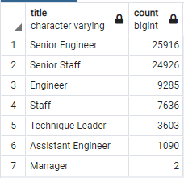
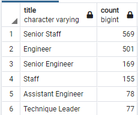

# Pewlett-Hackard-Analysis

## Overview of analysis

The purpose of this challenge was to use PostgreSQL to combine tables in order to make determinations about a companies aging workforce.  

### Purpose

First all the tables were created and data was uploaded. Then the table associated with the employee information was joined with the table associated with the title information. While combining these two tables a filter was added to only
include employees that had birth dates between 1952 and 1955. Then I created an additional table with this information filtering for employees still present at the company and removing duplicate employee entries in order to only show the
current role of each employee. Then I used a count on the titles to create a final table with a list of the number of each job title likely to retire soon. In the second portion of this challenge I joined the table associated with the 
employee data with the department employee data and the title data. In this process a filter was created for people born during 1965 to determine potential people eligible to be mentored. Then I ensured that only title was the most recent
title held by the employee was in the table and that they were still with the company. 

	
## Results

After analyzing the results it seems that the company is close to having significant staff turnover and that unless the company is currently significantly overstaffed they will run into issues. 

### Analysis of Retiring Staff and Mentorship Candidates

Of the issues that are about to plague the company are:

* Roughly 1/4 of employees of the company are about to retire. Below is the breakdown of the titles of the employees nearing retirement.

* The largest segment of retiring staff are senior engineers. This could cause problems with technical knowledge within the organization.

* The company is only considering individuals born in 1965. This seems to be a short sited and arbitrary way of deciding who should be eligible for mentorship. If they wanted to come up with an effective solution for selecting mentees 
they would determine which employees are most impactful that are about to retire and pair them with promising newer engineers that have received good performance reviews. It would also be important to sort them by discipline.

* The list of mentees is rather small in comparison to the list of employees about to retire. The following was generated for comparison to the retiring_titles table.

## Summary
The two major concerns that the company has going forward are regarding the number of employees about to retire, and whether there are enough qualified staff to fill their positions when they are gone.

 
### Business Recommendations

* How many roles will need to be filled as the "silver tsunami" begins to make an impact? 

At a glance it seems that 72,458 jobs will need to be filled due to employees hitting retirement age, however it is possible that some of this has already been planned for. Due to the fact that Pewlett Hackard is a technology company
maybe some of the older employees are maintaining legacy systems that will be retired alongside the employees. It is also possible that due to new innovations Pewlett Hackard they will need fewer of certain roles of employees in the 
future. An additional query that would be beneficial would be to join the department table with the department employees table and the retirement titles table to determine which job titles they are losing from which departments for 
further information. Another query that would provide useful information would be joining the retiring titles table with the salaries table in order to determine how much money will be freed up once these employees retire to hire 
additional replacement employees. 

* Are there enough qualified, retirement-ready employees in the departments to mentor the next generation of Pewlett Hackard employees?

At a glance the answer to this question is no. Based on the additional query counting all of the titles in the mentorship eligibility table (seen in the results section) it seems there are only 1549 employees eligible for the program. 
As mentioned earlier the criteria for selecting employees eligible for mentorship is arbitrary and should be broadened and specific to the positions needed. 
 
